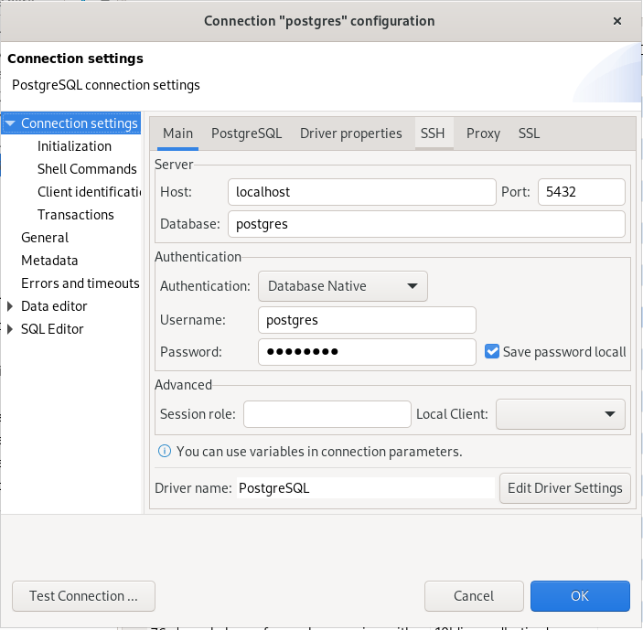
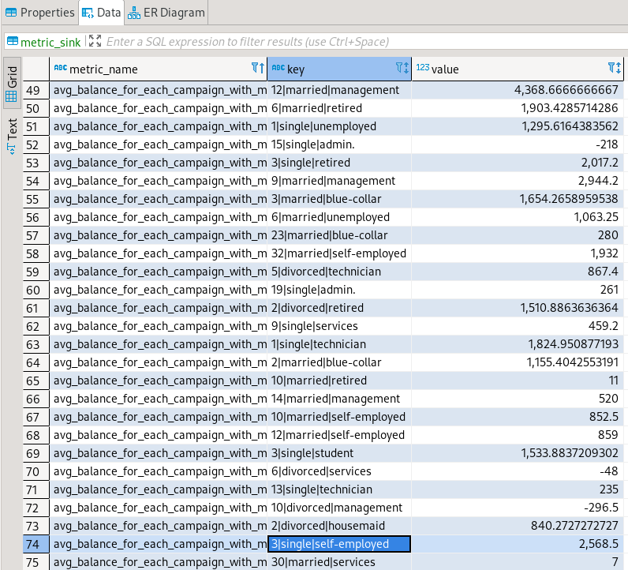
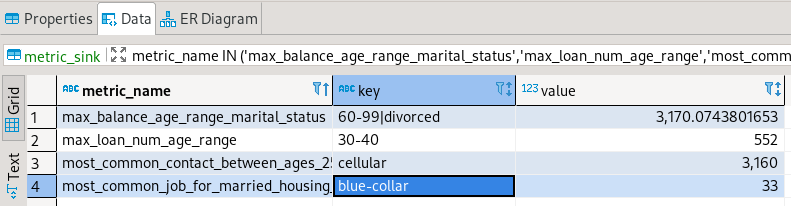
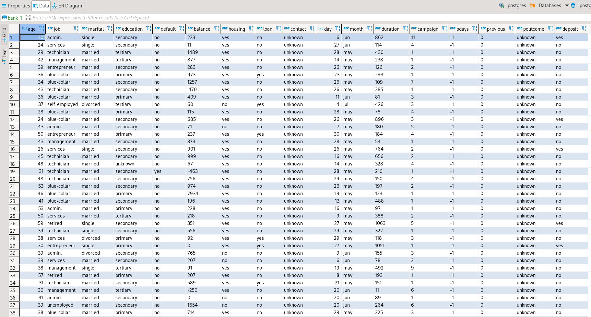

Hi, this project is made for a quick test with Spark with Java, so the main purpose is analise some data and use it for doing operations:

**The requisites (in spanish) are the following:**

A partir del dataset de datos bancarios que se adjunta (bank.csv)

Se le solicita preparar los siguientes ETL

1. Crear una ETL que disponibilice la información para que los usuarios lo puedan consultar la información con un cliente SQL.

2.Crear una ETL en la que resolver las siguientes preguntas:

* ¿Cual es el rango de edad, qué contrata más prestamos?
* ¿Cuál es el rango edad y estado civil que tiene más dinero en las cuentas?
* ¿Cuál es la forma más común de contactar a los clientes, entre 25-35 años?
* ¿Cuál es el balance medio, máximo y minimo por cada tipo de campaña, teniendo en cuenta su estado civil y profesión?
* ¿Cuál es el tipo de trabajo más común, entre los casados (job=married), que tienen casa propia (housing=yes), y que tienen en la cuenta más de 1.200€ y qué son de la campaña 3?****

To set everything up we need to use maven in the project to download all dependencies and then download and deploy the postgres image.

For installing the docker image needed, just use this command:

`docker pull postgres
`

Then you should just use the /reources/docker_deploy.sh file and run this command writen there:

`docker run --name my_postgres -p 5432:5432 -e POSTGRES_PASSWORD=postgres postgres
`
Then lets go and configure postgres in a client to run queries. This is Postgres connection configuration in Dbeaver:

Everything should run fine and then you can run:

`PGPASSWORD=postgres psql -h localhost -U postgres -d postgres -a -f CREATE_TABLE.sql
`

To create a simple empty table matching the requisites (this is only to test, as the table would be truncated and overwritten later in the spark pipeline).

You can also perform a DELETE of the whole table:

`PGPASSWORD=postgres psql -h localhost -U postgres -d postgres -a -f DELETE_TABLE.sql
`

Once everything is set in postgres, you should be able to run first **/src/main/java/AppIngestionPostgres.java** to be able to ingest everything in the **/resources/bank_1.csv file** into the Postgres table bank_1.

The second script **/src/main/java/AppDataAnalise.java** runs the whole query part of the requirements and formats everything to be inserted in a table called **_metric_sink_** and this table will be the one with all the metrics regarding the whole 5 queries asked.

You can interact with it in the Dbeaver Client. Here are some captures that show that the data works:
In this one we get one full look at metrics_sink table:

Here we see a filter with the metrics that are unique (as the fourth requirement asks for lots of data depending some values):

And here we got all bank_1 table:

